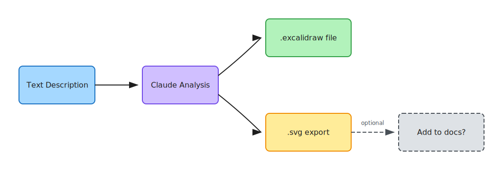

# Excalidraw Plugin

Create Excalidraw diagrams from text descriptions and export to SVG.



## Commands

### `/excalidraw:create <diagram-name> <description>`

Generate a diagram from a text description.

**Usage:**

```bash
/excalidraw:create architecture-diagram Create a system architecture showing the API gateway, microservices, and database layer

/excalidraw:create login-flow User authentication flow with email verification

/excalidraw:create network-topology Network diagram showing load balancer, web servers, and database cluster
```

**What it does:**

1. Parses your description to determine diagram type
2. Generates valid Excalidraw JSON with appropriate shapes and connections
3. Saves to `docs/diagrams/<name>.excalidraw`
4. Generates SVG export at `docs/diagrams/<name>.svg`
5. Offers to add diagram to your documentation

**Output:**

```
Created:
- docs/diagrams/architecture-diagram.excalidraw
- docs/diagrams/architecture-diagram.svg

Would you like me to add this diagram to your documentation?
```

## Supported Diagram Types

The command automatically detects diagram type from your description:

- **Architecture diagrams**: system components, services, layers
- **Flowcharts**: processes, workflows, decision trees
- **Entity diagrams**: database schemas, relationships
- **Network diagrams**: topology, connections, nodes
- **General diagrams**: any visual representation

## Installation

### From claude-kit marketplace

```bash
# Add the marketplace
claude plugin marketplace add pwood16/claude-kit

# Install the plugin
claude plugin install excalidraw@claude-kit --scope user
```

### Local development

```bash
claude --plugin-dir /path/to/claude-kit/plugins/excalidraw
```

## Permissions

**What this command can do:**

- Create directories (`mkdir`)
- Write `.excalidraw` and `.svg` files
- Read existing docs for integration

**What it cannot do:**

- Execute arbitrary commands
- Modify files outside the project
