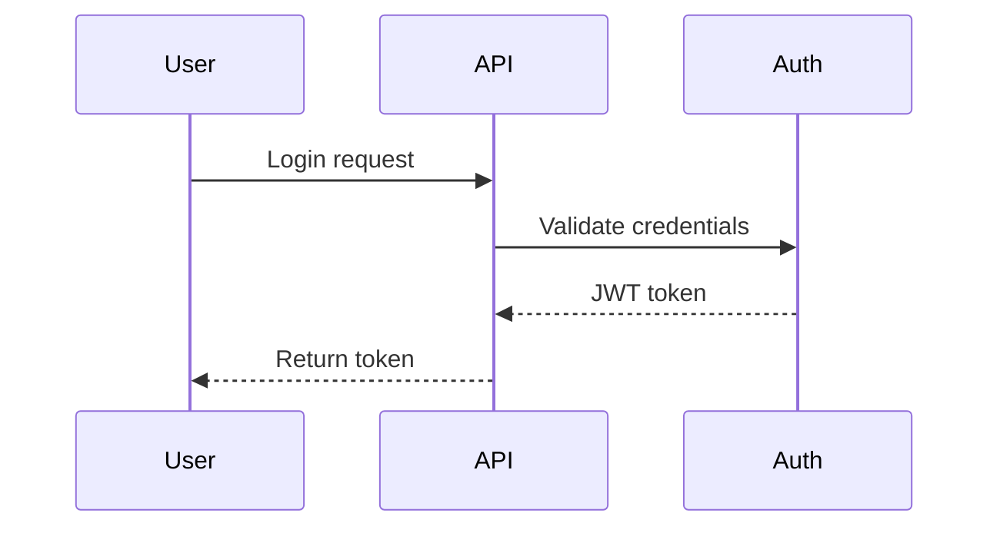

# Create Draft PR

Intelligently stage changes, commit, push, and create a draft PR with AI-generated description.

## Your Task

### 1. Analyze current state

**Check branch and changes:**
- Current branch: `git branch --show-current`
- Unstaged files: `git status --porcelain`
- Unpushed commits: `git log origin/$(git branch --show-current)..HEAD --oneline` (if branch exists remotely)

### 2. Branch handling

**If on `main`:**
- Analyze unstaged changes to understand what they're about
- Generate a short, descriptive branch name (2-4 words, kebab-case)
- Create new branch: `git checkout -b feature/{short-description}`
- Example: `feature/add-auth`, `feature/fix-validation`, `feature/improve-performance`

**If on feature branch:**
- Continue with current branch
- Understand branch context from existing commits (if any)

### 3. Smart file staging

**Analyze unstaged files:**
- Use `git diff` to understand what changed in each file
- If there are existing commits on the branch, use `git log` to understand the branch's purpose
- Categorize files:
  - **High confidence related**: Files clearly related to the main change
  - **Unclear**: Files that might be unrelated or tangential

**Staging strategy:**
- Auto-stage high-confidence related files
- For unclear files, use `AskUserQuestion` with:
  - Clear list of files already staged (with reason)
  - List of unclear files with brief explanation of what changed
  - Ask which unclear files to include

**Example prompt:**
```
Files I'm staging for this PR:
✓ src/auth.ts (authentication logic changes)
✓ src/auth.test.ts (related test updates)

Unclear files:
? README.md (documentation updates - include?)
? .gitignore (added entries - include?)

Which unclear files should I include?
```

### 4. Commit changes

**Generate commit message:**
- Analyze all staged changes
- Create concise commit message (50 char title max)
- Follow conventional commit format if applicable (feat:, fix:, refactor:, etc.)
- Focus on WHAT changed, not implementation details
- Examples:
  - `feat: add JWT authentication`
  - `fix: handle null values in user profile`
  - `refactor: simplify error handling logic`

**Commit:**
- Run: `git commit -m "<generated-message>"`

### 5. Push to remote

- Run: `git push -u origin <branch-name>`

### 6. Create draft PR with AI-generated description

**Analyze PR scope:**
- Get all commits since branching from main: `git log origin/main..HEAD --oneline`
- Get full diff: `git diff origin/main..HEAD`
- Read modified files to understand context and intent

**Generate PR description following this structure:**

```markdown
## Summary

[2-3 sentences explaining WHAT changed and WHY. Focus on the business/technical reason for the change, not implementation details.]

## Changes

[Bulleted list of key changes, grouped logically. Each bullet should be one line, focusing on user-facing or architectural impacts.]

## Testing

[Specific steps to test this PR. Include:
- Setup requirements (if any)
- Step-by-step test instructions
- Expected outcomes
- Edge cases to verify]

## Technical Notes

[Optional section - only if there are important technical details, gotchas, or decisions to explain. Include mermaid diagrams here if complexity warrants.]

[MERMAID DIAGRAM - Only if it helps visualize the change]
[Use flowchart for logic/decision flows, sequence for interaction flows]
[Example:

]
```

**Guidelines for PR description:**
- Be succinct - no fluff or unnecessary words
- Limit emojis (max 0-2 total, only if genuinely helpful)
- Focus on WHY over HOW
- Mermaid diagrams: Only when they clarify complex flows
  - Use `flowchart TD` for decision/logic flows
  - Use `sequenceDiagram` for interaction flows
  - Keep diagrams simple (5-10 nodes max)
- Testing section should be actionable and specific

**Create PR:**
- Run: `gh pr create --draft --title "<generated-title>" --body "<generated-description>"`
- Title should match commit message style (50 chars max, sentence case, no period)

### 7. Output

After creating PR:
- Display PR URL
- Show PR number for reference
- Confirm it was created as draft

## Security Note

**What this command can do:**
- Stage and commit changes
- Create branches
- Push to remote
- Create draft PRs

**What it cannot do:**
- Merge or close PRs
- Force push
- Delete branches
- Modify existing commits (rebase, amend)
