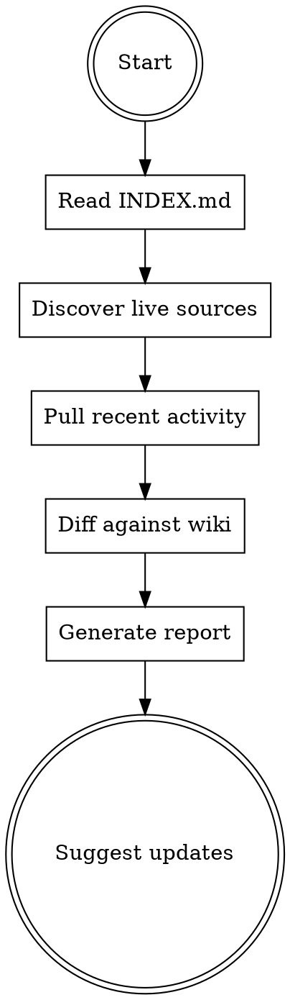

# Brain Health Check

Review the `~/dev/hub/brain/` wiki against live data sources to find stale content, missing topics, and contradictions.

## What "live sources" means here

This skill is intentionally agnostic about *which* sources you have wired up. At minimum it can use:

- **File mtimes** under `~/dev/hub/` — what has changed since the wiki was last compiled
- **GitHub activity** — if `gh` CLI is available, recent PRs and commits on repos the wiki mentions

Optionally, if the user has configured them, also check:

- Jira / Linear (via MCP tool, if installed)
- Notion / other note systems (via MCP)
- Any other system the user names

If none of the optional sources are configured, fall back to file mtimes + GitHub only and say so in the report. Don't fabricate connections that don't exist.

## Health Check Process



1. **Read `~/dev/hub/brain/INDEX.md`** — get the current topic list and last-updated dates. If INDEX.md is missing, suggest running `/brain` first.
2. **Discover live sources** — check which of the following are available without prompting:
   - `gh auth status` succeeds → GitHub is wired up
   - Hub subdirs with files newer than each topic's `Last updated` date
   - MCP tools whose names suggest Jira/Linear/Notion
   - For sources only reachable as rendered HTML (vendor docs, external pages), use `agent-browser` to fetch and extract — see "Agent Browser" at the bottom
3. **Pull recent activity** in parallel:
   - File mtimes under `~/dev/hub/` for the last 7 days
   - For each repo named in the wiki: `gh pr list --repo <org>/<repo> --state merged --limit 20 --json title,mergedAt,body` (only if the user has cloned/uses that repo)
4. **Diff against wiki** — for each wiki domain file:
   - Is the `Last updated` date more than 7 days old?
   - Are there new files in hub subdirs touching that domain since the last update?
   - Are there resolved tickets / merged PRs that answer open questions?
5. **Check for gaps**:
   - New investigation files with no wiki topic
   - Repos / projects with significant recent activity and no domain file
   - Contradictions between wiki claims and recent activity
6. **Generate report**

## Report Format

```markdown
## Brain Health — YYYY-MM-DD

Sources checked: file mtimes, gh CLI ✓ | Jira: not configured | Notion: not configured

### Stale Topics (last updated > 7 days, new activity found)
- **domain-a** — 3 PRs merged since last update, 2 tickets resolved
- **domain-b** — new investigation 003-<topic>.md not reflected

### Missing Topics
- **domain-c** — investigations 018 + 021 exist under hub/research/ but no wiki page

### Resolved Questions
- domain-a.md Q: "Can we write back to <external system>?" → TICKET-335 merged, answer is yes

### Contradictions
- wiki says X, but PR #142 changed this to Y

### Healthy Topics
- domain-d, domain-e — up to date, no new activity
```

## After the Report

- If called automatically from another skill: include the summary, don't auto-update
- If called standalone (`/brain-health`): present the report, then ask if the user wants to run `/brain` on any stale topics
- If critical staleness (>14 days + significant activity): recommend immediate update

## When NOT to use

| Don't | Do instead |
|---|---|
| Hub doesn't have a `brain/` dir yet | Run `/brain` first; nothing to health-check until there's a wiki |
| User wants to actually update the wiki | `/brain` does the update; this skill is read-only |
| User asks "what changed today" with no wiki context | Use `gh` / `git log` directly; this skill is about wiki freshness, not raw activity |

## Agent Browser

For sources that aren't reachable via API (external docs, vendor pages, rendered HTML):

- Use `agent-browser` to fetch and extract content
- Save extracted content to `~/dev/hub/brain/raw/` as `.md` files with a source URL header
- Example: vendor API docs, competitor pages, external research
