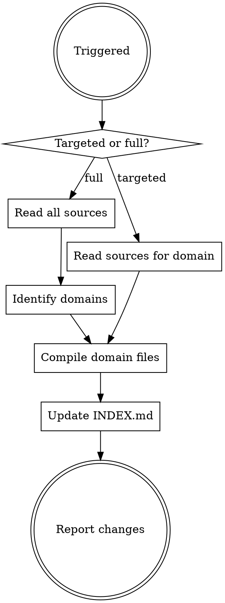

# Brain — Second Brain Wiki Compiler

Compile the `~/dev/hub/brain/` wiki from all source material in the hub. The wiki is organized by domain — one file per topic, AI-maintained, never hand-edited.

## Hub root resolution

The hub root is `~/dev/hub/` unless the user has overridden it. If `~/dev/hub/` does not exist, tell the user to run `/hub init` first — don't silently compile against a different directory or fabricate the structure yourself.

## Sources

Read from every subdirectory of the hub root that exists. Tolerate missing ones — skip silently. Typical layout:

| Source dir | What's there |
|------------|-------------|
| `brain/raw/` | Pristine source material — often symlinks to other repos, exports, transcripts |
| `research/` | Dated investigations |
| `decisions/` | ADRs |
| `tasks/` | Open action items |
| `plans/` | Implementation plans |

If the user keeps additional top-level subdirs in the hub, treat them as sources too — the rule is "anything under `~/dev/hub/` that isn't `brain/<domain>.md` itself is fair game."

**Never read from `brain/<domain>.md` as a source.** Those files are outputs of this skill; treating them as sources causes drift loops.

## Workflow



### Full compile (`/brain`)

1. Scan all sources listed above (skip missing dirs)
2. Identify distinct domain topics (group by architectural area, product feature, system, or recurring theme — domain names are kebab-case)
3. For each domain, write or update `~/dev/hub/brain/<domain>.md`
4. Regenerate `~/dev/hub/brain/INDEX.md`
5. Report: new topics, updated topics, source counts

### Targeted compile (`/brain <domain>`)

1. Read the existing `~/dev/hub/brain/<domain>.md` if it exists
2. Scan all sources for content related to that domain
3. Rewrite the domain file with current information
4. Update `~/dev/hub/brain/INDEX.md`

## Wiki File Format

Every domain file in `brain/` must follow this structure:

```markdown
# <Domain Name>

> Last updated: YYYY-MM-DD | Sources: N files across M locations

## Summary
One-paragraph overview of this domain area.

## Current State
What exists today — architecture, systems, data flows.

## Key Decisions
- [YYYY-MM-DD] Decision description (source: path/to/file)

## Recent Activity
Notable recent changes from synced repos, transcripts, meetings.

## Open Questions
- Unresolved items with source references

## Related Topics
- [[other-domain]]
```

## Rules

- **Never delete information** — update or mark as superseded with dates
- **Always cite sources** — every claim links to a file path under the hub
- **Flag conflicts** — if two sources disagree, note both with sources
- **Keep summaries tight** — the summary paragraph should be useful in 10 seconds
- **Preserve open questions** — don't remove them until they're answered (move to Key Decisions with the answer)
- **Don't duplicate raw content** — summarize and link, don't copy-paste
- **One domain per file** — if a file gets above ~300 lines, propose a split into two domains rather than letting it grow

## When NOT to use

| Don't | Do instead |
|---|---|
| User asks "what's in file X" | Just read the file — this skill is for cross-source synthesis, not single-file lookup |
| User wants to draft a new doc/PRD from scratch | Use the brainstorming/writing-plans skills — brain is for compiling existing material |
| Hub root doesn't exist yet | Ask the user where their hub is or whether to create `~/dev/hub/` — don't fabricate one |
