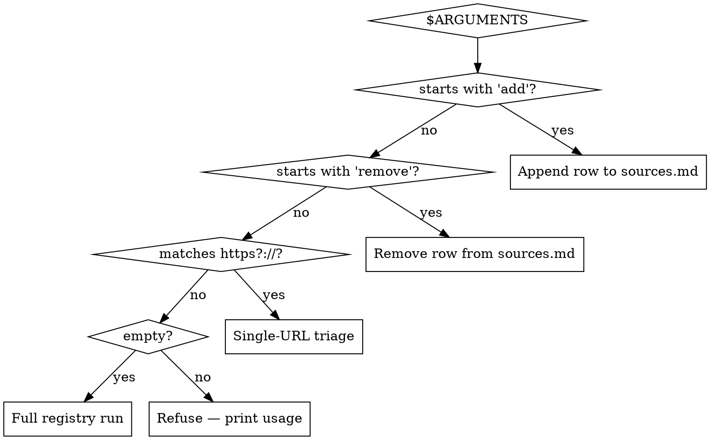
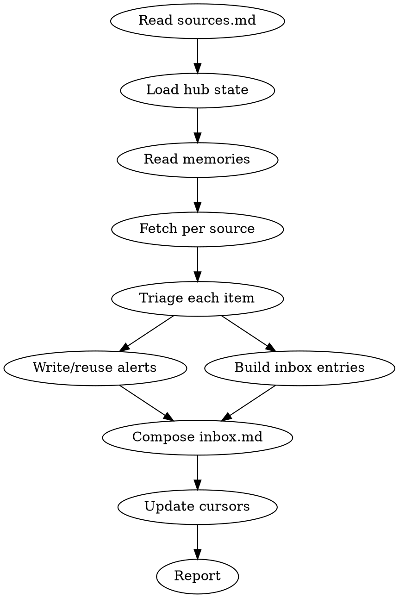

# Curate — Article Triage

Triage articles from a registry of feeds + manual sources, raise standouts to Phil's inbox, and flag items that contradict active hub state as course-correction alerts. Sister to `/brain` (which synthesizes accumulated material into domain pages) — `/curate` handles the inflow.

## Hub root resolution

The hub root is `~/dev/hub/`. If it does not exist, tell the user to run `/hub init` first — do not silently fabricate one or write to a different directory.

The files this skill touches:

| Path | Purpose |
|---|---|
| `brain/sources.md` | Source registry — hand-editable; mutated by `add`/`remove` |
| `brain/inbox.md` | Curated digest — rewritten on full runs, prepended on single-URL runs |
| `brain/raw/<source-slug>/` | Manual-source drop zone — read-only for this skill. `<source-slug>` = `Source` lowercased, spaces → `-`, non-alphanumeric dropped (e.g., `TLDR (paste)` → `tldr-paste`) |
| `brain/raw/curate-skipped.log` | Append-only filter-out log for tuning |
| `tasks/alert-<slug>.md` | One file per active course-correction alert |

The skill **never** edits files outside the hub root (with the sole exception of reading the memories below). It does not write to or modify `tasks/spawn-*.md`, `plans/*.md`, `decisions/*.md`, or `brain/<domain>.md` files — those are read-only context.

## Invocation modes



| Mode | Trigger | Behavior |
|---|---|---|
| Full run | `/curate` (no args) | Fetch every registry source past its cursor; triage; rewrite `inbox.md`; write any new alerts; update cursors |
| Ad-hoc URL | `/curate <url>` | Fetch one URL; triage; **prepend** a single entry to the matching bucket in `inbox.md`. URL need not be in registry |
| Registry add | `/curate add <url> [tier]` | Append a row to `brain/sources.md`. Tier defaults to `practitioner`; reject any tier outside the four-bucket vocabulary |
| Registry remove | `/curate remove <name-or-url>` | Remove the row matching by `Source` first, then by URL. Refuse on multi-match; do not silently no-op on zero-match |

If `$ARGUMENTS` matches none of the above (e.g., random text, a non-URL bare word), refuse and print the usage block from the table above. Do not guess.

### Argument parsing notes

- `$ARGUMENTS` is a single string. Tokenize on whitespace, but for `remove` treat everything after the keyword as the match string (strip surrounding `"` or `'`) so multi-word source names work.
- URL detection: `^https?://`. Anything else is not a URL.
- Tier vocabulary: `canonical`, `practitioner`, `synthesis`, `marketing`. Case-insensitive; normalize to lowercase when writing the row.

### Required-token preconditions (refuse, do not guess)

- `/curate add` (no second token, or second token is not a URL): refuse, print the `add` usage line, exit.
- `/curate add <url> <tier> <extra>` (more than two tokens after `add`): refuse, print the `add` usage line, exit.
- `/curate add <url> <bad-tier>` (tier outside the four-bucket vocabulary): refuse, print the valid vocabulary, exit.
- `/curate remove` (no second token, or only whitespace): refuse, print the `remove` usage line, exit.

These preconditions short-circuit the workflow before any file read or mutation. Treat them as the same level as a frontmatter validation failure.

## Memories the skill must respect

Load each of these named memories before any triage decision — they encode Phil's calibration and rule the decision tree. They are **read-only references** — never edit them from this skill. Reference them by name, not by file path; the agent's own memory subsystem resolves them.

- `feedback-source-typing-taxonomy` — the four-bucket taxonomy (canonical / practitioner / synthesis / marketing) and how to weight claims by bucket. Source tier is not a free pass; canonical sources making out-of-domain claims drop to synthesis weight.
- `user-ai-discourse-posture` — discount distant-skeptic "AI is hype" content; engage with concrete-pattern try-it-out content; weight practitioner-critics (Goedecke admitting UI testing fails) heavier than thinkpieces.
- `user-agent-reality-calibration` — anchor synthesis in primary sources; flag novel-vs-echoing claims; do not pathologize Phil's reality-check instinct.

If any of these memories cannot be loaded, surface that fact in the final report rather than triaging blind.

## Source registry — `brain/sources.md`

Markdown table, hand-editable and skill-mutable. If the file does not exist when a run starts, create it with the schema header below — never assume rows.

```markdown
# Sources

> Curated source registry for /curate. Hand-edit rows or use `/curate add` / `/curate remove`.

| Source | URL | Type | Tier | Last fetched |
|---|---|---|---|---|
```

Columns:
- **Source** — human-readable name. Required.
- **URL** — RSS/Atom feed URL, or `—` for manual sources.
- **Type** — `rss` | `manual`.
- **Tier** — `canonical` | `practitioner` | `synthesis` | `marketing`. Source default; per-item override allowed (see triage).
- **Last fetched** — ISO-8601 timestamp cursor (UTC, e.g., `2026-05-18T14:00:00Z`). `—` if never fetched.

### `add` semantics

`/curate add <url> [tier]`:
1. Required-token preconditions above must pass first (URL present, ≤ 2 tokens after `add`, valid tier if supplied).
2. **URL uniqueness check.** If any existing row has the same URL (exact match), refuse and report which row already has it. Do not write a duplicate.
3. Derive `Source` from the URL: prefer the host (e.g., `https://example.com/feed.xml` → `example.com`). If a row with that name exists but a *different* URL, suffix `(2)`, `(3)`, etc.
4. Default `Type` to `rss`. (Manual sources are added by hand-editing the table — they have no URL.)
5. Default `Tier` to `practitioner` if omitted.
6. Set `Last fetched` to `—` (the sentinel value meaning "no cursor yet — fetch everything on the next run").
7. Append the row using the format in `templates/sources-row.md`. Report the row written.

### `remove` semantics

`/curate remove <name-or-url>`:
1. Match by exact `Source` name first; if no match, fall back to URL.
2. If multiple rows match (e.g., disambiguating `(2)` suffixes), refuse and list candidates.
3. If no rows match, say so explicitly — never silently no-op.

## Triage logic

Inputs every triage decision sees:

- Article — title + content (fetched via `WebFetch` for RSS items / single URLs; or read from `brain/raw/<source-slug>/` for manual sources newer than the cursor).
- Source tier from `sources.md` (default `synthesis` for ad-hoc URLs with no registry hit; note the inferred tier in the entry).
- Active hub state — every `brain/*.md` except `inbox.md`, every `tasks/spawn-*.md` with `status: running`, every `plans/*.md`, every `decisions/*.md`. Tolerate missing dirs; skip silently.
- The three memories listed above.

Decision tree, in priority order — stop at the first match:

| Signal | Output | Bucket |
|---|---|---|
| Contradicts an active dispatch / plan / brain page (see definition below) | Alert file **and** Critical inbox entry | Critical |
| Practitioner-tier, concrete pattern relevant to active work | Inbox entry | High |
| Canonical artifact-change relevant to active work (model release, API/spec change, pricing) | Inbox entry | High |
| Practitioner-tier, novel framing not yet in brain | Inbox entry | Medium |
| Marketing from a canonical-tier lab **with no artifact change** — vision/positioning/research-direction post, not a model release or spec announcement (those are row 3) | Inbox entry — direction signal | Low |
| Synthesis-tier consensus shift (multiple synthesis sources converge on a claim) | Inbox entry | Low |
| None of the above | Skipped → one line appended to `brain/raw/curate-skipped.log` | — |

**Canonical-tier labs** for rows 3 and 5: foundational AI labs (Anthropic, OpenAI, Google DeepMind, Meta AI) plus infra giants (AWS, Cloudflare, GCP, Azure) — the set authorized by `feedback-source-typing-taxonomy`.

### Defining "contradicts active work"

A new article *contradicts* an active artifact (brain page, plan, decision, or running dispatch) when **either** of these holds:

- The article asserts X and the active artifact asserts not-X about the same subject (direct negation of a stated claim, recommendation, or working hypothesis).
- The article documents a concrete failure mode that the active artifact assumes does not exist (e.g., active dispatch assumes tool Y works for use-case Z; article shows Y fails Z with reproducible evidence).

Disagreements of *framing* or *emphasis* without a claim collision are not contradictions — they're potential `echo` or Medium entries. When unsure, prefer Medium with a Why-raised that names the soft disagreement; reserve Critical for the two crisp cases above. Cite the file path (and line if findable) of the contradicted artifact in the alert's `## What this contradicts / extends` section.

### Per-item override

Items can be re-tagged from the source default when content contradicts the source's bucket (e.g., a practitioner blog post that turns out to be overt sponsored content re-tags `practitioner` → `marketing`). Record the override in the inbox entry as `Re-tagged: <from> → <to> (<reason>)`. Per `user-ai-discourse-posture`, practitioner-critic content stays practitioner — concrete failure-mode evidence is not "marketing" just because it sits on a vendor blog.

### Filter-outs

Items the filter drops (silent skip, not raised). Each appends one tab-separated line to `brain/raw/curate-skipped.log`:

```
<ISO timestamp>	<source>	<tier>	<url>	<reason-tag>
```

Reason tags (use exactly one):
- `mid-tier-marketing` — marketing tier from non-foundational vendor.
- `canonical-non-substantive` — marketing from a canonical-tier lab that's neither an artifact change (row 3) nor a direction signal (row 5) — e.g., hiring, culture, event recaps.
- `distant-skeptic` — naysayer content with no concrete failure-mode evidence (per `user-ai-discourse-posture`).
- `echo` — restates content already in a brain page with no new angle (per `user-agent-reality-calibration`).
- `too-thin` — too sparse to triage (e.g., feed item with no body fetched).

The log is the calibration handle — if one reason starts dominating, the filter is wrong. Surface a hint in the final report when any reason exceeds 50% of skips on a single run.

## Inbox output — `brain/inbox.md`

Single living file. Items grouped by bucket, sorted by recency (newest first) within bucket. Items roll off after 14 days from `raised_at`.

Skeleton in `templates/inbox-skeleton.md`:

```markdown
# Inbox — Curated Raises

> Last updated: <ISO timestamp> by /curate

## Critical (course-correction alerts)

- <YYYY-MM-DD> — <one-line summary> → see `tasks/alert-<slug>.md` (affects: <comma-sep paths>)

## High

### <Title> — <source> (<tier>) — <YYYY-MM-DD>
**Take:** <one sentence: what it says>
**Why raised:** <one sentence: what pushed it past the filter — must name the active brain page, plan, or dispatch it connects to, or the novel angle it brings>
<link>

## Medium

(entries as in High)

## Low

(entries as in High)
```

Each non-Critical entry follows `templates/inbox-entry.md`. The leading `YYYY-MM-DD` in each heading is the parse key for 14-day rollover — keep it.

**The "Why raised" field is the calibration handle.** It must name the active brain page, plan, or dispatch the entry connects to, or the novel angle it brings. "Looked interesting" or "good writeup" is not acceptable — if you can't connect it, log it as `echo` or `too-thin` instead.

### 14-day rollover (full run only)

On a full run:
1. Read existing `inbox.md`.
2. Parse each entry's date:
   - Critical lines: leading `- <YYYY-MM-DD>` after the dash + space.
   - Non-Critical entries: trailing ` — <YYYY-MM-DD>` at the end of the `###` heading.
3. Drop entries dated more than 14 days before "now".
4. Merge with new entries from this run (deduplicate by URL — newer entry wins on rebucketing).
5. Sort within bucket by date desc; rewrite the file.

Raw files in `brain/raw/` remain the permanent record — entries roll off the inbox, not the source.

### Single-URL run additivity

`/curate <url>` does NOT rewrite the whole file and does NOT run rollover. It triages the single URL, writes an alert if Critical, and prepends one entry to the matching bucket. Update only the `Last updated:` header and the touched bucket.

**Prepend insertion anchor:** insert the new entry directly **after the bucket's `## <Bucket>` heading line** (and the blank line that follows it), so the new entry becomes the topmost item in that bucket. If the bucket has no existing entries (just heading + blank), the new entry becomes the bucket's first item — preserve a trailing blank line before the next `## <Bucket>` heading. Two agents seeing the same state must land on the same insertion point.

## Course-correction alerts — `tasks/alert-<slug>.md`

One file per active alert. Matches the hub-task frontmatter convention (sibling to `spawn-*.md`). Template at `templates/alert.md` (the `{{affects_list}}` placeholder is rendered by the agent as one `  - <path>` bullet per affected file — the template holds a single slot, not the bullets themselves):

```markdown
---
type: alert
slug: <kebab-case>
status: open
raised_at: <ISO timestamp, UTC>
source_url: <link>
source_tier: <canonical|practitioner|synthesis|marketing>
affects:
  - <path/to/affected/file-or-dispatch>
  - ...
---

## Claim
<what the article says, 1-2 sentences>

## What this contradicts / extends
<the specific working assumption that's challenged, with file:line refs where possible>

## Suggested edit
<1-2 sentence sketch of what should change in the affected file(s)>
```

### Slug derivation

Kebab-case from the article title, max 6 words, lowercase, drop non-alphanumeric except `-`. If a file with that slug already exists:
- If its `source_url` matches and `status: open` — **reuse** the existing file (don't duplicate). Update `raised_at` and re-link from inbox.
- Otherwise (different source, same slug collision) — suffix `-2`, `-3`, etc.

### Lifecycle

- `status: open` → surfaces in the Critical inbox section on every run.
- Phil edits the frontmatter to `applied` or `dismissed` to close.
- Closed alerts stay in `tasks/` as historical record — same pattern as harvested `spawn-*.md`. The next `/curate` run reads `status` and only surfaces `open`.

### Hard limits

- **No auto-pause of affected dispatches.** Alerts flag; Phil decides. Never write to or stop any `spawn-*.md`.
- **No push notifications.** Out of scope.
- **No new dispatches generated from alerts.** Phil decides whether to launch.

## Full-run workflow



1. **Read `sources.md`.** If missing, create the schema header, report "no sources configured — add some with `/curate add <url>`", and stop.
2. **Load hub state** for contradiction detection: `brain/*.md` (except `inbox.md`), `tasks/spawn-*.md` with `status: running`, `plans/*.md`, `decisions/*.md`. Also read open `tasks/alert-*.md` so existing alerts can be reused rather than duplicated.
3. **Load the three named memories** listed in "Memories the skill must respect" via the agent's memory subsystem — by name, not by file path.
4. **Fetch each source** newer than its `Last fetched` cursor (treat `—` as "no cursor — fetch everything"):
   - `rss` — `WebFetch` the feed URL, parse items, fetch each item's link for content. Skip items already represented under `brain/raw/<source-slug>/` by URL match.
   - `manual` — `ls` files under `brain/raw/<source-slug>/` with mtime > cursor. Slug rule defined in the "files this skill touches" table above.
5. **Triage** each item against the decision tree above. Apply per-item overrides as needed.
6. **Write/reuse alerts** for Critical items. One file under `tasks/alert-<slug>.md` per active alert; reuse existing `open` alerts with the same `source_url`.
7. **Build inbox entries** for non-skipped items. Each Critical item also gets a one-line pointer in the Critical section of `inbox.md`.
8. **Compose `inbox.md`** — merge new entries with the surviving 14-day window, sort within bucket, rewrite.
9. **Update cursors** in `sources.md` — set `Last fetched` to this run's start ISO timestamp for every source that was polled cleanly (including those that yielded zero new items). A source that failed to fetch keeps its previous cursor and is reported as `failed` in the summary.
10. **Report** — see Reporting below.

## Single-URL workflow

`/curate <url>`:

1. **Resolve tier.** If the URL host matches a `URL` cell in `sources.md`, use that row's `Tier`. Otherwise default to `synthesis` and note `Tier inferred: synthesis (no registry match)` in the entry's Why-raised.
2. **Fetch** the URL with `WebFetch`.
3. **Load hub state + memories** (same as full run).
4. **Triage** against the same decision tree.
5. **If Critical:** write/reuse an alert file under `tasks/alert-<slug>.md`.
6. **Prepend** the inbox entry. Update only `Last updated:` and the touched bucket. Do not rewrite untouched buckets. Do not run rollover.
7. **Report** — single-entry summary.

## Reporting

End every run with a structured summary:

```
Sources fetched: <n> (rss: <a>, manual: <b>, failed: <f>)
Items triaged:   <m>
Raised:          critical=<c> high=<h> medium=<med> low=<l>
Skipped:         <s> (see brain/raw/curate-skipped.log)
Alerts opened:   <list of slugs, or "none">
Alerts reused:   <list of slugs, or "none">
Inbox:           <absolute path>
```

If nothing changed (no new items past every cursor), say so explicitly — do not pretend to have raised entries you did not write.

If any memory failed to load, surface that fact at the top of the report so the user knows the triage ran without full calibration.

If a single skip-reason exceeds 50% of total skips on this run, append a one-line hint: `Filter hint: <reason> dominates skips — calibration may be off.`

## Rules

- **Never delete brain pages, plans, decisions, or alerts.** Update or mark superseded; never destructive. Closed alerts stay in `tasks/`.
- **Cite the source.** Every inbox entry links to the original URL. Every alert names the affected file path(s) in `affects:`.
- **Tag with bucket inline** in inbox entries (`(practitioner)`, `(canonical)`, etc.) — the visible tag is Phil's calibration handle (per `feedback-source-typing-taxonomy`).
- **Why-raised discipline.** No entry ships with a vague rationale. If you can't connect it to active work or name a novel angle, log it as `echo` or `too-thin` instead.
- **No archive layer for inbox.** 14-day rollover is the only retention rule. Raw sources are the permanent record.
- **No scheduled fetching.** `/curate` runs on demand only.
- **No memory mutation.** The three memories above are read-only references.

## When NOT to use

| Don't | Do instead |
|---|---|
| Compile or refresh a brain wiki page | `/brain [domain]` — `/curate` triages new arrivals; `/brain` synthesizes accumulated material into domain pages |
| Health-check brain freshness | `/brain-health` — different read |
| Add a hand-written research note | Drop the file under `~/dev/hub/research/` directly; `/brain` will pick it up |
| Triage a brain domain page | Brain pages are already synthesized; `/curate` is for raw new arrivals |
| Read one web page for its content | Use `WebFetch` directly — `/curate` is for triage with a written outcome, not lookup |
| Stop or modify an active dispatch | Alerts flag only; Phil decides. Edit `tasks/spawn-*.md` by hand if intervention is needed |

## Reference

- Sister skills: `/brain` (compile), `/brain-health` (audit). A future `/brain` Phase-6 integration (invoking `/curate` as its first step) is **not** part of this skill — it lands in a follow-up PR.
- Memories (read-only): `feedback-source-typing-taxonomy`, `user-ai-discourse-posture`, `user-agent-reality-calibration`.
- Hub layout: `~/dev/hub/CLAUDE.md`.
- Templates (relative to this skill): `templates/sources-row.md`, `templates/inbox-entry.md`, `templates/inbox-skeleton.md`, `templates/alert.md`.
