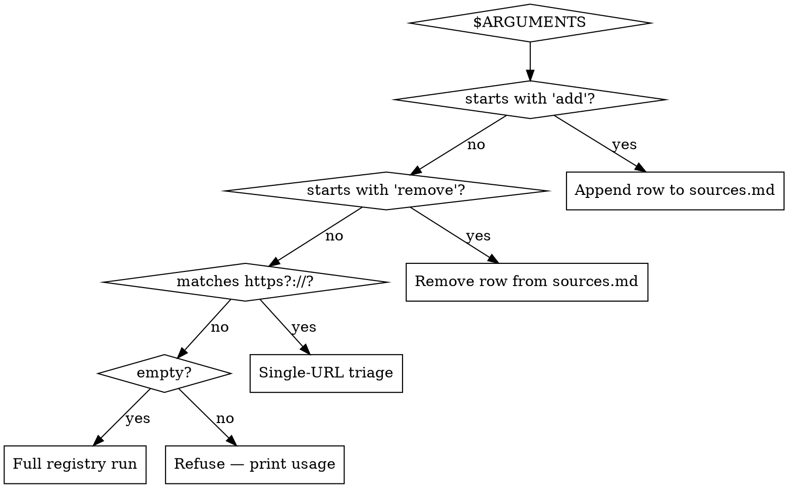
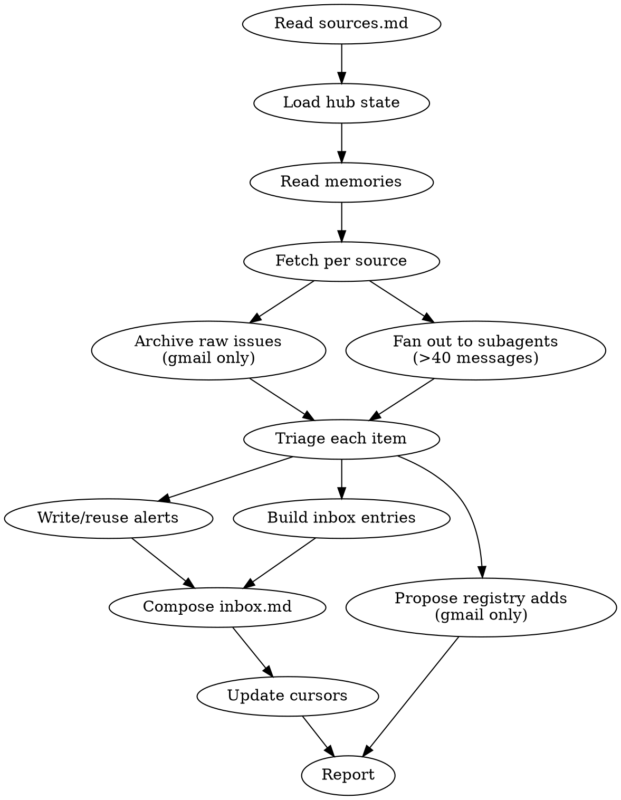

# Curate — Article Triage

Triage articles from a registry of feeds + manual sources, raise standouts to Phil's inbox, and flag items that contradict active hub state as course-correction alerts. Sister to `/brain` (which synthesizes accumulated material into domain pages) — `/curate` handles the inflow.

## Hub root resolution

The hub root is `~/dev/hub/`. If it does not exist, tell the user to run `/hub init` first — do not silently fabricate one or write to a different directory.

The files this skill touches:

| Path | Purpose |
|---|---|
| `brain/sources.md` | Source registry — hand-editable; mutated by `add`/`remove` |
| `brain/inbox.md` | Curated digest — rewritten on full runs, prepended on single-URL runs |
| `brain/raw/<source-slug>/` | Per-source raw archive. **Read-only for `manual` sources** (you drop files there yourself). **Written by this skill for `gmail` sources.** **Slug rule:** lowercase; spaces → `-`; drop everything except `[a-z0-9-]`; collapse runs of `-`; trim leading/trailing `-` (e.g., `Acme Weekly (paste)` → `acme-weekly-paste`). **Name a source so its slug matches the directory it should write to** — a `gmail` row for TLDR must be named `TLDR` so it slugs to `tldr` and finds the existing archive; `TLDR (paste)` would slug to `tldr-paste` and re-archive the whole corpus into an empty parallel tree |
| `brain/raw/curate-skipped.log` | Append-only filter-out log for tuning |
| `tasks/alert-<slug>.md` | One file per active course-correction alert |

The skill **never** edits files outside the hub root (with the sole exception of reading the memories below). It does not write to or modify `tasks/spawn-*.md`, `plans/*.md`, `decisions/*.md`, or `brain/<domain>.md` files — those are read-only context.

## Invocation modes


```dot
digraph args {
  "$ARGUMENTS" [shape=diamond];
  "starts with 'add'?" [shape=diamond];
  "starts with 'remove'?" [shape=diamond];
  "matches https?://?" [shape=diamond];
  "empty?" [shape=diamond];

  "Append row to sources.md" [shape=box];
  "Remove row from sources.md" [shape=box];
  "Single-URL triage" [shape=box];
  "Full registry run" [shape=box];
  "Refuse — print usage" [shape=box];

  "$ARGUMENTS" -> "starts with 'add'?";
  "starts with 'add'?" -> "Append row to sources.md" [label="yes"];
  "starts with 'add'?" -> "starts with 'remove'?" [label="no"];
  "starts with 'remove'?" -> "Remove row from sources.md" [label="yes"];
  "starts with 'remove'?" -> "matches https?://?" [label="no"];
  "matches https?://?" -> "Single-URL triage" [label="yes"];
  "matches https?://?" -> "empty?" [label="no"];
  "empty?" -> "Full registry run" [label="yes"];
  "empty?" -> "Refuse — print usage" [label="no"];
}
```

| Mode | Trigger | Behavior |
|---|---|---|
| Full run | `/curate` (no args) | Fetch every registry source past its cursor; triage; rewrite `inbox.md`; write any new alerts; update cursors |
| Ad-hoc URL | `/curate <url>` | Fetch one URL; triage; **prepend** a single entry to the matching bucket in `inbox.md`. URL need not be in registry |
| Registry add | `/curate add <url> [tier]` | Append a row to `brain/sources.md`. Tier defaults to `practitioner`; reject any tier outside the four-bucket vocabulary |
| Registry remove | `/curate remove <name-or-url>` | Remove the row matching by `Source` first, then by URL. Refuse on multi-match; do not silently no-op on zero-match |

If `$ARGUMENTS` matches none of the above (e.g., random text, a non-URL bare word), refuse and print the usage block below. Do not guess.

```
Usage:
  /curate                          full registry run
  /curate <url>                    triage one article
  /curate add <url> [tier]         add an rss source (tier: canonical|practitioner|synthesis|marketing)
  /curate remove <name-or-url>     remove a source
```

The `add` usage line and the `remove` usage line referenced below are the `/curate add` and `/curate remove` lines of that block.

### Argument parsing notes

- `$ARGUMENTS` is a single string. Tokenize on whitespace, but for `remove` treat everything after the keyword as the match string (strip surrounding `"` or `'`) so multi-word source names work.
- URL detection: `^https?://`. Anything else is not a URL.
- Tier vocabulary: `canonical`, `practitioner`, `synthesis`, `marketing`. Case-insensitive; normalize to lowercase when writing the row.

### Required-token preconditions (refuse, do not guess)

- `/curate add` (no second token, or second token is not a URL): refuse, print the `add` usage line, exit.
- `/curate add <url> <tier> <extra>` (more than two tokens after `add`): refuse, print the `add` usage line, exit.
- `/curate add <url> <bad-tier>` (tier outside the four-bucket vocabulary): refuse, print the valid vocabulary, exit.
- `/curate remove` (no second token, or only whitespace): refuse, print the `remove` usage line, exit.

These preconditions short-circuit the workflow before any file read or mutation. Treat them as the same level as a frontmatter validation failure.

## Memories the skill must respect

Load each of these named memories before any triage decision — they encode Phil's calibration and rule the decision tree. They are **read-only references** — never edit them from this skill. Reference them by name, not by file path; the agent's own memory subsystem resolves them.

- `feedback-source-typing-taxonomy` — the four-bucket taxonomy (canonical / practitioner / synthesis / marketing) and how to weight claims by bucket. Source tier is not a free pass; canonical sources making out-of-domain claims drop to synthesis weight.
- `user-ai-discourse-posture` — discount distant-skeptic "AI is hype" content; engage with concrete-pattern try-it-out content; weight practitioner-critics (Goedecke admitting UI testing fails) heavier than thinkpieces.
- `user-agent-reality-calibration` — anchor synthesis in primary sources; flag novel-vs-echoing claims; do not pathologize Phil's reality-check instinct.

If any of these memories cannot be loaded, surface that fact in the final report rather than triaging blind.

## Source registry — `brain/sources.md`

Markdown table, hand-editable and skill-mutable. If the file does not exist when a run starts, create it with the schema header below — never assume rows.

```markdown
# Sources

> Curated source registry for /curate. Hand-edit rows or use `/curate add` / `/curate remove`.

| Source | URL | Type | Tier | Last fetched |
|---|---|---|---|---|
```

Columns:
- **Source** — human-readable name. Required.
- **URL** — RSS/Atom feed URL; a **Gmail query** for `gmail` sources (e.g. `from:dan@tldrnewsletter.com`); or `—` for manual sources.
- **Type** — `rss` | `manual` | `gmail`.
- **Tier** — `canonical` | `practitioner` | `synthesis` | `marketing`. Source default; per-item override allowed (see triage).
- **Last fetched** — ISO-8601 timestamp cursor (UTC, e.g., `2026-05-18T14:00:00Z`). `—` if never fetched.

### `add` semantics

`/curate add <url> [tier]`:
1. Required-token preconditions above must pass first (URL present, ≤ 2 tokens after `add`, valid tier if supplied).
2. **URL uniqueness check.** If any existing row has the same URL (exact match), refuse and report which row already has it. Do not write a duplicate.
3. Derive `Source` from the URL: prefer the host (e.g., `https://example.com/feed.xml` → `example.com`). If a row with that name exists but a *different* URL, suffix `(2)`, `(3)`, etc.
4. Default `Type` to `rss`. (Manual sources are added by hand-editing the table — they have no URL. `gmail` sources are also added by hand-editing, since their `URL` cell holds a Gmail query rather than a URL and would fail the `^https?://` check in step 1.)
5. Default `Tier` to `practitioner` if omitted.
6. Set `Last fetched` to `—` (the sentinel value meaning "no cursor yet — fetch everything on the next run").
7. Append the row using the format in `templates/sources-row.md`. Report the row written.

### `remove` semantics

`/curate remove <name-or-url>`:
1. Match by exact `Source` name first; if no match, fall back to URL.
2. If multiple rows match (e.g., disambiguating `(2)` suffixes), refuse and list candidates.
3. If no rows match, say so explicitly — never silently no-op.

## Gmail sources (`Type: gmail`)

Newsletters arrive by email, so no feed URL exists to poll. A `gmail` source names a Gmail query
instead, and the skill fetches, archives, and triages in one pass.

**A `gmail` run produces three outputs:** raw issues archived to `brain/raw/<source-slug>/`, inbox
entries for the **articles the issues link to**, and registry-add proposals for recurring publishers.
All three are required — an archive-only run has not curated, and a triage-only run destroys the
permanent record `/brain` compiles from.

**The load-bearing invariant: a file present in `brain/raw/<source-slug>/` means that issue has
already been triaged.** Archive an issue only after its triage completes. That is what makes dedup a
safe triage predicate — skipping already-archived issues can never skip an untriaged one. Archiving
first would break it: a range whose triage died would sit on disk looking done forever.

**Gmail is read-only.** Use `search_threads` and `get_thread` and nothing else. Never label, draft,
archive, delete, or otherwise mutate mail state — mail is shared state outside the hub root, and the
hub-root guarantee is meaningless if the skill can write to it.

### 1. Fetch

Load the Gmail tools first — they are deferred, so they must be fetched before they can be called:

```
ToolSearch("select:mcp__claude_ai_Gmail__search_threads,mcp__claude_ai_Gmail__get_thread")
```

Subagents do **not** inherit the parent's loaded tools; each one must run this `ToolSearch` itself.
Verified working — subagents can reach the Gmail MCP server. If the connection is unavailable the
call fails loudly; report the source `failed`, keep its cursor, and do not fabricate an empty result.

Build the query from the row's `URL` cell plus the cursor. `Last fetched: 2026-08-09T20:59:34Z`
becomes `<url-cell> after:2026/08/09`. A `—` cursor means no cursor yet — bound it with
`newer_than:30d` rather than leaving it open, and say in the report that the window was bounded.

Page with `pageSize: 50` (the documented maximum), passing the previous response's `nextPageToken`
back as the **`pageToken` request parameter**, until no token is returned. A full page is not the end
of results.

**Two counting hazards before you size the run.** `search_threads` returns *threads*, not messages,
and Gmail matches a whole thread when any one message matches. Per-message dates need `get_thread`,
so use the **thread count as the sizing proxy** for the fan-out decision — it is close enough for a
threshold and needs no extra reads. Reconcile to a true message count once bodies are fetched, and
report that number. And Gmail's date operators resolve in the account's timezone while the cursor is
UTC, so the boundary day both re-fetches and can miss; dedup covers the re-fetch, and the
`newer_than:30d` floor plus a one-day overlap on fan-out boundaries covers the miss.

Read bodies with `get_thread` at `messageFormat: FULL_CONTENT`.

### 2. Archive

**Match the conventions already in `brain/raw/<source-slug>/` before inventing any.** If the
directory holds files, read one and follow its filename shape and frontmatter keys exactly. The
rules below describe the existing hub convention and are the default when the directory is empty.

**Resolve the realpath of the write target and assert it is under the hub root** before writing;
refuse and report the source `failed` otherwise. Testing only whether `brain/raw/<source-slug>/` is a
symlink is not enough — `brain/raw/` itself is documented as a place symlinks to other repos live, so
a symlinked parent passes that test and the write still escapes the hub root.

**Filename:** `YYYY-MM-DD-<newsletter-slug>.md`, where `YYYY-MM-DD` is the received date **in UTC**
and `<newsletter-slug>` identifies the publication (see below). Append `-<HHMM>` (UTC) only when that
path is already taken by a different message — never pre-emptively.

**One sender can carry several publications.** `from:dan@tldrnewsletter.com` delivers both TLDR and
TLDR AI, and the existing archive separates them (`2026-05-25-tldr.md`, `2026-05-25-tldr-ai.md`).
Derive `<newsletter-slug>` from the issue's own masthead in the body, slugged by the rule in the
files-touched table; fall back to `<source-slug>` when no masthead is discoverable. Do not try to
split them by Gmail query — their subject lines are not distinguishable.

**Body:** write `plaintext_body`, not a markdown conversion of `html_body`. The existing corpus is
plaintext-derived, and switching mid-corpus changes the texture of the record `/brain` compiles from.
If `plaintext_body` is empty, fall back to `html_body` converted to markdown and note
`body_source: html` in the frontmatter. Never write an empty body — a lossy archive is silent data
loss.

**Frontmatter** — fill `templates/raw-issue.md` from these sources:

| Field | Value |
|---|---|
| `newsletter` | the `<newsletter-slug>` derived above |
| `date` | received date, `YYYY-MM-DD`, UTC |
| `subject` | the message subject verbatim, including emoji |
| `sender` | the `From` address |
| `gmail_thread_id` | thread `id` from `search_threads` |
| `gmail_message_id` | message `id` from `get_thread` — the Gmail API id, **not** the RFC822 `Message-ID` header, which these tools do not return |

**Dedup on `gmail_message_id`** against the files already in the directory. Skip any message already
archived — by the invariant above, it has been triaged, so skipping it is safe. Re-triaging every
boundary-day issue would inflate `curate-skipped.log` and corrupt the 50%-of-skips calibration hint
that reads from it.

Write the file only after that issue's links have been triaged and its findings are in hand. On a
fanned-out run that means the parent archives a range's issues when that range's subagent returns
successfully, and **archives nothing for a range that failed** — leaving those issues absent so the
next run re-fetches, re-triages and archives them.

Raw files are never deleted and never roll off. Only inbox entries expire.

### 3. Triage the linked articles, not the issue

**This is the rule that makes newsletter sources worth having.** A newsletter issue is a container of
ten or so items; raising "today's TLDR" as one entry is useless. Triage each linked article as its own
item against the normal decision tree. The issue itself is never raised and never skip-logged.

Tier follows the **linked article's own publisher**, not the newsletter's:

| What you're triaging | Tier |
|---|---|
| The newsletter's editorial summary of an item, where the article itself is unreachable | `synthesis` |
| A linked post on an individual engineer's blog | `practitioner` |
| A linked vendor engineering blog | `practitioner` (note the vendor) |
| A linked foundational-lab or infra-giant post, or a primary spec | `canonical` |
| A linked launch/PR post | `marketing` — usually skipped |

Record the inheritance in the entry as `Via: <newsletter-slug> — <YYYY-MM-DD> issue`, so provenance
stays visible without the newsletter's tier contaminating the claim's weight.

**Links.** TLDR-style newsletters wrap every link in a redirector, and resolving hundreds of
redirects per run is not affordable. Resolve in this order: assign the tier from the destination host
shown in the newsletter's own link text or surrounding copy; triage; then resolve the redirect **only
for items that survived triage**. Cite the resolved URL. If it will not resolve, cite the tracking
link and add `Unresolved redirect` to the entry rather than shipping an entry with no link — Rules
requires every entry to carry one.

**Paywalled or 403 article:** fall back to the newsletter's editorial summary, tier it `synthesis`,
and mark the entry `Body unavailable — triaged from newsletter summary`. Do not log `too-thin` when a
usable summary exists.

### 4. Volume — fan out above the threshold

Size the run from the thread count returned by `search_threads`, before fetching any bodies.

Note the cost this accepts: the parent fetches every body to archive, and each subagent fetches its
range again to triage. Issues in a fanned-out range are fetched twice. That is the price of keeping
the archive lossless while isolating triage context, and it is deliberate.

| Messages past cursor | Approach |
|---|---|
| ≤ 40 | Triage inline. |
| 41–160 | **Split across parallel subagents** — chunks of ~40, 4 agents maximum. |
| > 160 | Process the oldest 160 as above, advance the cursor to the end of what completed, and report the remainder as still pending. Do not silently truncate — the remainder is untriaged and unarchived, so the next run picks it up. |

Split by **half-open date range** — `[start, end)` — so adjacent chunks cannot both claim the
boundary day. Density is uneven across dates, so derive boundaries from the message counts you
already have rather than dividing the calendar evenly.

**Each subagent receives all of:** its half-open date range; the Gmail query; the **full text** of the
three calibration memories (subagents do not inherit the parent's memory, so paste content, not
names); a hub-state summary sufficient to judge relevance; the tier table above; the decision tree
and its bucket definitions; the "contradicts active work" definition; the five filter-out reason
tags; the Why-raised discipline; and an instruction to write nothing. An underspecified brief is why
two agents bucket the same article differently.

**Return schema** — subagents return both halves, because the parent cannot reconstruct either:

```
{ raises: [ { title, publisher, url, tier, bucket, take, why_raised, via, contradicts? } ],
  skips:  [ { url, publisher, tier, reason_tag } ],
  covered: { start, end, messages_read } }
```

Without `skips[]` a fanned-out run writes no skip lines at all, which silently breaks the
50%-dominance calibration hint. The parent writes those lines from the returned array.

**Division of labour is fixed:** subagents return triage findings only — never issue bodies. **The
parent does its own archive pass and writes every file.** Routing the archive through a summarizing
channel would make it lossy, and concurrent writers would clobber `inbox.md`.

**On partial failure** — a subagent that errors, times out, or returns nothing — advance the cursor
only to the end of the **contiguous successful prefix** of ranges, report the source as `partial`,
and name the uncovered ranges. A cursor advanced past an untriaged range hides the hole permanently,
and the archive will look complete because the parent wrote it.

Report the range each agent covered. A gap between ranges is a silent coverage hole.

### 5. Propose registry additions for recurring publishers

Newsletters are a **source-discovery mechanism**, not just a source. When the same publisher produces
**2 or more raises in a single gmail run**, propose adding them to the registry so future runs stop
depending on the newsletter as intermediary.

- Key on the registrable domain (eTLD+1), except for platform hosts where the author is the
  publisher — treat `medium.com/@user` and equivalent as distinct publishers.
- **Skip domains already present in `sources.md`.**
- Critical raises count the same as any other.
- Find and verify the feed URL before suggesting it. If the site serves several, prefer the one
  linked from its own HTML `<link rel="alternate">`. If it has no feed, omit the proposal rather
  than suggesting something the user cannot paste and run.

Propose, never auto-add — the same rule as alerts. This block appears only on runs that included a
gmail source.

### 6. Failure handling

| Situation | Do this |
|---|---|
| Gmail tools unavailable at start | Report the source `failed`, keep its cursor, continue with other sources. |
| Gmail auth fails mid-run | Archive only issues whose triage finished; leave the rest unarchived. Advance the cursor to the last fully triaged message, report `partial`, name the uncovered range. |
| A subagent errors, times out, or returns nothing | Cursor advances only to the end of the contiguous successful prefix; report `partial` with the uncovered ranges. Never treat an empty return as "nothing to raise". |
| `plaintext_body` empty | Fall back to markdown-converted `html_body` and set `body_source: html`. Never archive an empty body. |
| Neither body form usable | Skip the archive for that issue, report it by subject and date, and do not advance the cursor past it. |
| Linked article paywalled or 403 | Triage from the newsletter's editorial summary at `synthesis`, marked `Body unavailable — triaged from newsletter summary`. Not `too-thin`. |
| `brain/raw/<source-slug>/` is a symlink | Refuse the archive, report the source `failed`. |

## Triage logic

Inputs every triage decision sees:

- Article — title + content (fetched via `WebFetch` for RSS items / single URLs; read from `brain/raw/<source-slug>/` for manual sources newer than the cursor; or the **linked article** for `gmail` sources, per "Triage the linked articles, not the issue" above).
- Source tier from `sources.md`. For items with no registry row — ad-hoc URLs and articles linked from a newsletter — **resolve the tier from the publisher using `feedback-source-typing-taxonomy`, not from a fixed default.** An infra giant or foundational lab is `canonical` even when it arrives as a bare URL; an individual engineer's blog is `practitioner`. Fall back to `synthesis` only when the publisher genuinely doesn't map. Record the resolution in the entry (`Tier resolved: canonical (infra-giant rule, no registry match)`) so the judgement is visible.
- Active hub state — every `brain/*.md` except `inbox.md`, every `tasks/spawn-*.md` with `status: running`, every `decisions/*.md`, and **`plans/*.md` + `research/*.md` from the last 90 days** (both grow without bound; `research/` holds the most recently synthesized findings, which is what a new article is most likely to contradict). Read `brain/INDEX.md` first and use it to decide which domain pages need reading in full. Tolerate missing dirs; skip silently.
- The three memories listed above.

Decision tree, in priority order — stop at the first match:

| Signal | Output | Bucket |
|---|---|---|
| Contradicts an active dispatch / plan / brain page (see definition below) | Alert file **and** Critical inbox entry | Critical |
| Practitioner-tier, concrete pattern relevant to active work | Inbox entry | High |
| Canonical artifact-change relevant to active work (model release, API/spec change, pricing) | Inbox entry | High |
| Practitioner-tier, novel framing not yet in brain | Inbox entry | Medium |
| Marketing from a canonical-tier lab **with no artifact change** — vision/positioning/research-direction post, not a model release or spec announcement (those are row 3) | Inbox entry — direction signal | Low |
| Synthesis-tier consensus shift (multiple synthesis sources converge on a claim) | Inbox entry | Low |
| None of the above | Skipped → one line appended to `brain/raw/curate-skipped.log` | — |

**Canonical-tier labs** for rows 3 and 5: foundational AI labs (Anthropic, OpenAI, Google DeepMind, Meta AI) plus infra giants (AWS, Cloudflare, GCP, Azure) — the set authorized by `feedback-source-typing-taxonomy`.

### Defining "contradicts active work"

A new article *contradicts* an active artifact (brain page, plan, decision, or running dispatch) when **either** of these holds:

- The article asserts X and the active artifact asserts not-X about the same subject (direct negation of a stated claim, recommendation, or working hypothesis).
- The article documents a concrete failure mode that the active artifact assumes does not exist (e.g., active dispatch assumes tool Y works for use-case Z; article shows Y fails Z with reproducible evidence).

Disagreements of *framing* or *emphasis* without a claim collision are not contradictions — they're potential `echo` or Medium entries. When unsure, prefer Medium with a Why-raised that names the soft disagreement; reserve Critical for the two crisp cases above. Cite the file path (and line if findable) of the contradicted artifact in the alert's `## What this contradicts / extends` section.

### Per-item override

Items can be re-tagged from the source default when content contradicts the source's bucket (e.g., a practitioner blog post that turns out to be overt sponsored content re-tags `practitioner` → `marketing`). Record the override in the inbox entry as `Re-tagged: <from> → <to> (<reason>)`. Per `user-ai-discourse-posture`, practitioner-critic content stays practitioner — concrete failure-mode evidence is not "marketing" just because it sits on a vendor blog.

### Filter-outs

Items the filter drops (silent skip, not raised). Each appends one tab-separated line to `brain/raw/curate-skipped.log`:

```
<ISO timestamp>	<source>	<tier>	<url>	<reason-tag>
```

For an article linked from a `gmail` source, `<source>` is `<publisher-host> (via <newsletter-slug>)`
and `<tier>` is the item's resolved tier, not the registry row's. Stamping every newsletter skip with
the row's name and `synthesis` would erase the publisher, which is the only thing that makes the log
useful for tuning.

Reason tags (use exactly one):
- `mid-tier-marketing` — marketing tier from non-foundational vendor.
- `canonical-non-substantive` — marketing from a canonical-tier lab that's neither an artifact change (row 3) nor a direction signal (row 5) — e.g., hiring, culture, event recaps.
- `distant-skeptic` — naysayer content with no concrete failure-mode evidence (per `user-ai-discourse-posture`).
- `echo` — restates content already in a brain page with no new angle (per `user-agent-reality-calibration`).
- `too-thin` — too sparse to triage (e.g., feed item with no body fetched).

The log is the calibration handle — if one reason starts dominating, the filter is wrong. Surface a hint in the final report when any reason exceeds 50% of skips on a single run.

## Inbox output — `brain/inbox.md`

Single living file. Items grouped by bucket, sorted by recency (newest first) within bucket.
**Non-Critical items roll off 14 days after their raise date. Critical lines never roll off — the
Critical section is regenerated from open `tasks/alert-*.md` on every run.**

Skeleton in `templates/inbox-skeleton.md`:

```markdown
# Inbox — Curated Raises

> Last updated: <ISO timestamp> by /curate

## Critical (course-correction alerts)

- <YYYY-MM-DD> — <one-line summary> → see `tasks/alert-<slug>.md` (affects: <comma-sep paths>)

## High

### <Title> — <source> (<tier>) — <YYYY-MM-DD>
**Take:** <one sentence: what it says>
**Why raised:** <one sentence: what pushed it past the filter — must name the active brain page, plan, or dispatch it connects to, or the novel angle it brings>
<provenance lines — zero or more, one per line: `Via: …`, `Tier resolved: …`, `Re-tagged: …`, `Unresolved redirect`>
<link>

## Medium

(entries as in High)

## Low

(entries as in High)
```

Each non-Critical entry follows `templates/inbox-entry.md`. The **trailing** ` — <YYYY-MM-DD>` at the
end of the `###` heading is the parse key for rollover — keep it, and make it **the date the item was
raised, not the article's publication date.** Those differ, and using the publication date makes a
run roll off entries it created minutes earlier. Put the publication date in the Take if it matters.
For a cluster entry spanning several dates, the heading still carries the single raise date.

`{{source}}` is the **publisher**, not the newsletter — `{{tier}}` follows the publisher, and the
newsletter is named on the `Via:` line instead. When an entry has no provenance lines, omit
`{{provenance_lines}}` entirely rather than emitting a blank line.

**The "Why raised" field is the calibration handle.** It must name the active brain page, plan, or dispatch the entry connects to, or the novel angle it brings. "Looked interesting" or "good writeup" is not acceptable — if you can't connect it, log it as `echo` or `too-thin` instead.

### 14-day rollover (full run only)

On a full run:
1. Read existing `inbox.md`.
2. Parse each entry's date:
   - Critical lines: leading `- <YYYY-MM-DD>` after the dash + space.
   - Non-Critical entries: trailing ` — <YYYY-MM-DD>` at the end of the `###` heading.
3. Drop entries dated more than 14 days before "now". **Critical lines are exempt while their alert is still `open`** — regenerate the Critical section from `tasks/alert-*.md` (one line per `open` alert, newest first) rather than rolling it over. A closed alert's line drops on the next run.
   **Preserve by hand-merge, do not blank-slate:** the file's header block and any italic annotations on surviving entries (`*(updated with corroboration)*`, `*Verified this run: …*`) carry human edits. Rewrite means re-emit with new entries merged in, never regenerate from the empty skeleton.
4. Merge with new entries from this run (deduplicate by URL — the newer entry wins on bucket and Take, but **carry forward any italic annotations from the older one**; those are human edits, and "newer wins" would otherwise delete what step 3 just promised to preserve).
5. Sort within bucket by date desc; rewrite the file.

Raw files in `brain/raw/` remain the permanent record — entries roll off the inbox, not the source.

### Single-URL run additivity

`/curate <url>` does NOT rewrite the whole file and does NOT run rollover. It triages the single URL, writes an alert if Critical, and prepends one entry to the matching bucket. Update only the `Last updated:` header and the touched bucket.

**Prepend insertion anchor:** insert the new entry directly **after the bucket's `## <Bucket>` heading line** (and the blank line that follows it), so the new entry becomes the topmost item in that bucket. If the bucket has no existing entries (just heading + blank), the new entry becomes the bucket's first item — preserve a trailing blank line before the next `## <Bucket>` heading. Two agents seeing the same state must land on the same insertion point.

## Course-correction alerts — `tasks/alert-<slug>.md`

One file per active alert. Matches the hub-task frontmatter convention (sibling to `spawn-*.md`). Template at `templates/alert.md` (the `{{affects_list}}` placeholder is rendered by the agent as one `  - <path>` bullet per affected file — the template holds a single slot, not the bullets themselves):

```markdown
---
type: alert
slug: <kebab-case>
status: open
raised_at: <ISO timestamp, UTC>
source_url: <link>
source_tier: <canonical|practitioner|synthesis|marketing>
affects:
  - <path/to/affected/file-or-dispatch>
  - ...
---

## Claim
<what the article says, 1-2 sentences>

## What this contradicts / extends
<the specific working assumption that's challenged, with file:line refs where possible>

## Suggested edit
<1-2 sentence sketch of what should change in the affected file(s)>
```

### Slug derivation

Kebab-case from the article title, max 6 words, lowercase, drop non-alphanumeric except `-`. If a file with that slug already exists:
- If its `source_url` matches and `status: open` — **reuse** the existing file (don't duplicate). Update `raised_at` and re-link from inbox.
- Otherwise (different source, same slug collision) — suffix `-2`, `-3`, etc.

### Lifecycle

- `status: open` → surfaces in the Critical inbox section on every run.
- Phil edits the frontmatter to `applied` or `dismissed` to close.
- Closed alerts stay in `tasks/` as historical record — same pattern as harvested `spawn-*.md`. The next `/curate` run reads `status` and only surfaces `open`.

### Hard limits

- **No auto-pause of affected dispatches.** Alerts flag; Phil decides. Never write to or stop any `spawn-*.md`.
- **No push notifications.** Out of scope.
- **No new dispatches generated from alerts.** Phil decides whether to launch.

## Full-run workflow


```dot
digraph full_run {
  "Read sources.md" -> "Load hub state";
  "Load hub state" -> "Read memories";
  "Read memories" -> "Fetch per source";
  "Fetch per source" -> "Archive raw issues\n(gmail only)";
  "Fetch per source" -> "Fan out to subagents\n(>40 messages)";
  "Fan out to subagents\n(>40 messages)" -> "Triage each item";
  "Archive raw issues\n(gmail only)" -> "Triage each item";
  "Triage each item" -> "Write/reuse alerts";
  "Triage each item" -> "Build inbox entries";
  "Triage each item" -> "Propose registry adds\n(gmail only)";
  "Write/reuse alerts" -> "Compose inbox.md";
  "Build inbox entries" -> "Compose inbox.md";
  "Compose inbox.md" -> "Update cursors";
  "Update cursors" -> "Report";
  "Propose registry adds\n(gmail only)" -> "Report";
}
```

1. **Read `sources.md`.** If missing, create the schema header, report "no sources configured — add some with `/curate add <url>`", and stop.
2. **Load hub state** for contradiction detection — the input list under Triage logic, including `research/`. Also read open `tasks/alert-*.md` so existing alerts can be reused rather than duplicated.
3. **Load the three named memories** listed in "Memories the skill must respect" via the agent's memory subsystem — by name, not by file path.
4. **Fetch each source** newer than its `Last fetched` cursor (treat `—` as "no cursor — fetch everything"):
   - `rss` — `WebFetch` the feed URL, parse items, fetch each item's link for content. (rss items are not archived; the cursor alone bounds them.)
   - `manual` — `ls` files under `brain/raw/<source-slug>/` with mtime > cursor. Slug rule defined in the "files this skill touches" table above.
   - `gmail` — see "Gmail sources" above: fetch past the cursor, triage the **articles the issues link to**, and archive each issue to `brain/raw/<source-slug>/`. Fan out per "Volume" in that section.
5. **Triage** each item against the decision tree above. Apply per-item overrides as needed.
6. **Archive** (gmail sources only) — once a range's triage has returned, write its issues to `brain/raw/<source-slug>/` per "Gmail sources → Archive". The parent writes these even when triage was fanned out, and writes nothing for a range that failed.
7. **Write/reuse alerts** for Critical items. One file under `tasks/alert-<slug>.md` per active alert; reuse existing `open` alerts with the same `source_url`.
8. **Build inbox entries** for non-skipped items. Each Critical item also gets a one-line pointer in the Critical section of `inbox.md`.
9. **Compose `inbox.md`** — merge new entries with the surviving 14-day window, sort within bucket, rewrite.
10. **Propose registry adds** (gmail runs only) — publishers with 2+ raises this run and no existing row, per "Gmail sources → Propose registry additions". Emit in the report; never write the row.
11. **Update cursors** in `sources.md` — set `Last fetched` to this run's start ISO timestamp for every source that was polled cleanly (including those that yielded zero new items). A source that failed to fetch keeps its previous cursor and is reported as `failed`; a source that lost a subagent advances only to the end of its contiguous successful prefix and is reported as `partial`.
12. **Report** — see Reporting below.

## Single-URL workflow

`/curate <url>`:

1. **Resolve tier** by the rule in Triage logic → Inputs. Match on **host**: if the URL's host equals the host of an `rss` row's `URL` cell, use that row's `Tier`. Otherwise resolve from the publisher via `feedback-source-typing-taxonomy` and record `Tier resolved: …`. Never default to `synthesis` without checking the publisher — most ad-hoc URLs are articles, not feed URLs, so they will not match any row and the publisher rule is what actually decides. Skip `gmail` rows entirely when host-matching; their `URL` cell is a Gmail query containing a host-shaped substring that would false-match.
2. **Fetch** the URL with `WebFetch`.
3. **Load hub state + memories** (same as full run).
4. **Triage** against the same decision tree.
5. **If Critical:** write/reuse an alert file under `tasks/alert-<slug>.md`.
6. **Prepend** the inbox entry. Update only `Last updated:` and the touched bucket. Do not rewrite untouched buckets. Do not run rollover.
7. **Report** — single-entry summary.

## Reporting

End every run with a structured summary:

```
Sources fetched: <n> (rss: <a>, manual: <b>, gmail: <g>)   — n = a + b + g
Failed/partial:  <list of source names with reason, or "none">
Issues archived: <k> → brain/raw/<slug>/          one line per gmail source; omit if no gmail source ran
Items triaged:   <m>                              linked articles for gmail; feed/manual items otherwise
Raised:          critical=<c> high=<h> medium=<med> low=<l>
Skipped:         <s> (see brain/raw/curate-skipped.log)
Alerts opened:   <list of slugs, or "none">
Alerts reused:   <list of slugs, or "none">
Inbox:           <absolute path>

Fan-out coverage:                                 omit unless the run fanned out
  <agent>   <start> → <end>   <n> messages

Suggested registry adds (2+ raises this run):     omit unless a gmail source ran and something qualifies
  <publisher-domain>   <n> raises   /curate add <feed-url> <tier>
```

`Items triaged` counts **linked articles** for gmail sources, not issues — the two differ by roughly
an order of magnitude, so `Issues archived` is reported separately rather than folded in.

A source that failed entirely keeps its cursor. A source that fanned out and lost a subagent is
`partial`: its cursor advances only to the end of the contiguous successful prefix, and the report
names the uncovered ranges.

If nothing changed (no new items past every cursor), say so explicitly — do not pretend to have raised entries you did not write.

If any memory failed to load, surface that fact at the top of the report so the user knows the triage ran without full calibration.

If a single skip-reason exceeds 50% of total skips on this run, append a one-line hint: `Filter hint: <reason> dominates skips — calibration may be off.`

## Rules

- **Never delete brain pages, plans, decisions, or alerts.** Update or mark superseded; never destructive. Closed alerts stay in `tasks/`.
- **Cite the source.** Every inbox entry links to the original URL. Every alert names the affected file path(s) in `affects:`.
- **Tag with bucket inline** in inbox entries (`(practitioner)`, `(canonical)`, etc.) — the visible tag is Phil's calibration handle (per `feedback-source-typing-taxonomy`).
- **Why-raised discipline.** No entry ships with a vague rationale. If you can't connect it to active work or name a novel angle, log it as `echo` or `too-thin` instead.
- **No archive layer for inbox.** 14-day rollover is the only retention rule. Raw sources are the permanent record.
- **No scheduled fetching.** `/curate` runs on demand only.
- **No memory mutation.** The three memories above are read-only references.
- **Gmail is read-only.** `search_threads` and `get_thread` only. Never label, draft, archive, delete or otherwise mutate mail state.
- **Raw files are never deleted and never roll off.** Only inbox entries expire. `brain/raw/` is the permanent record `/brain` compiles from.
- **Never blank-slate `inbox.md`.** Merge into it; the header and hand-written annotations survive a rewrite.

## When NOT to use

| Don't | Do instead |
|---|---|
| Compile or refresh a brain wiki page | `/brain [domain]` — `/curate` triages new arrivals; `/brain` synthesizes accumulated material into domain pages |
| Health-check brain freshness | `/brain-health` — different read |
| Add a hand-written research note | Drop the file under `~/dev/hub/research/` directly; `/brain` will pick it up |
| Triage a brain domain page | Brain pages are already synthesized; `/curate` is for raw new arrivals |
| Read one web page for its content | Use `WebFetch` directly — `/curate` is for triage with a written outcome, not lookup |
| Read, search or summarize email | Use the Gmail tools directly — `/curate` touches mail only to archive and triage a registered `gmail` source |
| Stop or modify an active dispatch | Alerts flag only; Phil decides. Edit `tasks/spawn-*.md` by hand if intervention is needed |

## Reference

- Sister skills: `/brain` (compile), `/brain-health` (audit). A future `/brain` Phase-6 integration (invoking `/curate` as its first step) is **not** part of this skill — it lands in a follow-up PR.
- Memories (read-only): `feedback-source-typing-taxonomy`, `user-ai-discourse-posture`, `user-agent-reality-calibration`.
- Hub layout: `~/dev/hub/CLAUDE.md`.
- Templates (relative to this skill): `templates/sources-row.md`, `templates/inbox-entry.md`, `templates/inbox-skeleton.md`, `templates/alert.md`, `templates/raw-issue.md`.
- Gmail sources require the Gmail MCP tools (`mcp__claude_ai_Gmail__*`), which are deferred — load them with `ToolSearch` before calling, in the parent and in every subagent. A run without an authenticated claude.ai MCP connection will fail to fetch them; report the source as `failed` and keep its cursor rather than silently skipping.
