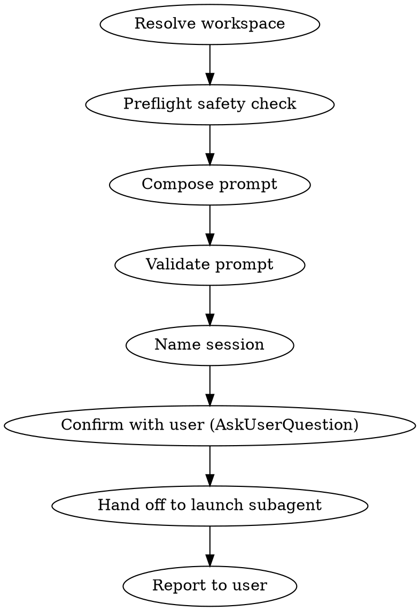

# Dispatch

Hand off work to a background Claude in a named tmux session. Skill input: the conversation so far. Skill output: a running tmux session with a Claude doing the work, plus a durable task file at `~/dev/hub/tasks/spawn-<sanitized>.md` for end-of-day harvest.

**Use when:** the current agent and user have agreed what needs doing and the next move is execution in a workspace clone, not more discussion.

**Do NOT use:**
- For parallel work on a new branch in the current repo → use `spawn:wt-agent` instead.
- For one-shot research where you don't need a persistent session → just answer in the current convo.

**Context discipline:** the main thread does the parts that need user judgment — workspace resolution, preflight, prompt composition, validation, naming, and the `AskUserQuestion` confirm. After that, the mechanical launch work (write files, start tmux, poll for the Claude session UUID, patch the task file) is delegated to a foreground subagent so its tool output never lands in the main conversation. The main thread only surfaces the subagent's final summary.

## Workflow



## Step 1 — Resolve workspace

Two modes. **Worktree mode is the default** for most dispatch work. **Own-folder mode** is the escape hatch for multi-week or multi-PR coordinated work where the workspace itself wants long-term identity (e.g., a ticket folder that hosts design docs + multiple branches over weeks).

### Worktree mode (default)

- Workspace path: `~/dev/dispatched/<sanitized>/<repo>/` — a git worktree off `~/dev/dispatched-head/<repo>/`.
- `~/dev/dispatched-head/<repo>/` is the **canonical source clone**: always on the repo's default branch, always clean. Never commit work there. Only `git fetch` + worktree creation.
- `~/dev/dispatched/<sanitized>/<repo>/` is the dispatch's working tree. Multiple repos sit as siblings (e.g., `~/dev/dispatched/<sanitized>/repo-a/` + `~/dev/dispatched/<sanitized>/repo-b/`).
- After the dispatch wraps, the worktree is cleaned up with `git worktree remove` (the harvest skill handles this).

### Own-folder mode (escape hatch)

- Workspace path: `~/dev/<TICKET>/<repo>/` — fresh full clones for multi-week work.
- Use when: multi-week effort with several coordinated PRs across repos, or the user explicitly says "in its own folder" / "in `~/dev/<TICKET>`".
- Pattern: `~/dev/<TICKET>/<repo>/`, e.g., `~/dev/proj-1430/<repo-a>/`, `~/dev/proj-383/{repo-a,repo-b}/`.
- These dirs need manual cleanup after the work ships — they're not auto-pruned.

### Resolution rule

- If the user names a specific path → use it (infer mode from path shape).
- Otherwise → propose worktree mode via `AskUserQuestion` with the slug and the repos to be worktree'd. Confirm before proceeding.

### Base-branch discovery

The dispatch skill never hardcodes a base branch. For each repo, discover dynamically:

```bash
base=$(git symbolic-ref refs/remotes/origin/HEAD 2>/dev/null | sed 's@^refs/remotes/origin/@@')
if [ -z "$base" ]; then
  base="main"   # fallback if origin/HEAD isn't set; run `git remote set-head origin -a` to populate it
fi
```

Use this in all `$base` substitutions below.

### Fresh-clone for own-folder

If own-folder mode is chosen and the target dir doesn't exist, set it up before Step 2:

1. `mkdir -p ~/dev/<TICKET>`
2. `git clone <repo-url>` inside it for each repo (e.g., `gh repo clone <org>/<repo>`)
3. Verify each lands on its base branch (use the discovery snippet above)

## Step 2 — Preflight safety check

### Worktree mode

The source clone must be **on the base branch and fresh** before worktree creation. The skill auto-refreshes it; you only block on conditions that auto-refresh can't fix.

```bash
cd ~/dev/dispatched-head/<repo>

# Discover base branch (never hardcode)
base=$(git symbolic-ref refs/remotes/origin/HEAD 2>/dev/null | sed 's@^refs/remotes/origin/@@')
[ -z "$base" ] && base="main"

git fetch --quiet

# Auto-refresh to the base branch
current=$(git symbolic-ref --short HEAD 2>/dev/null || echo "DETACHED")
if [ "$current" != "$base" ]; then
  git checkout "$base" || { echo "BLOCK: cannot checkout $base (likely dirty worktree); status follows:"; git status -sb; exit 1; }
fi

# Refuse to silently drop local work
ahead=$(git rev-list --count "origin/$base..HEAD")
if (( ahead > 0 )); then
  echo "BLOCK: dispatched-head/<repo> has $ahead local commits NOT on origin/$base — never commit in dispatched-head."
  git log --oneline "origin/$base..HEAD"
  exit 1
fi

# Fast-forward if behind. ff-only — if it can't ff, surface and block.
behind=$(git rev-list --count "HEAD..origin/$base")
if (( behind > 0 )); then
  git pull --ff-only origin "$base" || { echo "BLOCK: ff-only pull failed; inspect dispatched-head/<repo> manually."; exit 1; }
  echo "Refreshed dispatched-head/<repo>: fast-forwarded $behind commit(s) from origin/$base."
fi

git status -sb
```

**Block if** (conditions auto-refresh can't fix):

- `git checkout <base>` fails because the worktree is dirty in a blocking way (auto-generated untracked files like a build lock are fine; modified tracked files are not).
- Local commits exist on dispatched-head that aren't on origin — never commit in dispatched-head; move them to a real branch elsewhere first.
- ff-only pull fails (history diverged) — inspect manually before retrying.
- Target worktree path `~/dev/dispatched/<sanitized>/<repo>` already exists. Pick a different slug or remove the stale worktree (`git worktree remove`).

Then create the worktree:

```bash
cd ~/dev/dispatched-head/<repo>
git worktree add ~/dev/dispatched/<sanitized>/<repo> -b <user>/<short-slug> "$base"
```

`<base>` is the repo's default branch as discovered above. If the agent will only read (not branch), use `--detach "$base"` instead of `-b`.

### Own-folder mode

For an existing own-folder workspace:

```bash
cd <workspace>/<repo>
git fetch --quiet
git status -sb
git rev-list --count @{u}..HEAD 2>/dev/null
```

**Block if** `rev-list --count @{u}..HEAD` > 0 — current branch has unpushed commits. Surface with `git log @{u}..HEAD --oneline` and refuse until addressed.

For a fresh own-folder clone, preflight is trivial — confirm the clone landed on the base branch.

**Untracked files are fine in both modes** — note in the dispatch brief so the doing agent leaves auto-generated locks alone, but never block on them.

## Step 3 — Compose prompt

Read the skeleton at `templates/prompt-skeleton.md` (relative to this skill's directory). Compose the prompt from conversation context.

**Required sections (every dispatch must have all three):**

- `## Task` — 1-3 sentences. What and why.
- `## Don't` — each line: prohibition + concrete alternative. E.g., `No force push — use \`--force-with-lease\``.
- `## Report` — 1-2 sentences on what to communicate back.

**Required for code-changing dispatches:**

- `## Review` — multi-angle review loop expectation. Default: after local checks green, spawn parallel reviewer subagents (correctness + design/scope + pathway, plus security if relevant); iterate until reviewers converge with no Important findings (typically ~3 rounds); address each round's findings in a follow-up commit or fold-in; document round outcomes in the Report. Use the codebase's review skill if one exists (e.g. `/review`, `/security-review`). Without this, agents only run reviews when the target repo's conventions push them to — fragile.

**Optional sections (include only when they earn their keep):**

- `## Pointers` — bare list of paths, URLs, commands. **No prose paragraphs.** Trust the agent to read what's named.
- `## Steps` — short imperative bullets when the work is procedural.

**Style rules:**

- No pre-judged risk calls ("X is the highest-risk overlap"). Let the doing agent assess from what it reads.
- No prose dumps of things the agent can produce with one command (e.g., don't list incoming commits — point to `git log --oneline origin/<base>..HEAD`).
- Reference files by path, not by explanation.
- Target ≤ 80 lines, hard ceiling 150.

## Step 4 — Validate prompt

Run each check. Block-level failures must be fixed before launch. Warn-level failures get surfaced for user confirm.

| # | Check | Level |
|---|-------|-------|
| 1 | Branch ahead of remote in workspace (from Step 2) | **Block** |
| 2 | `wc -l < $prompt_file` > 80 | Warn |
| 3 | `wc -l < $prompt_file` > 150 | **Block** |
| 4 | Missing any of `## Task`, `## Don't`, `## Report` | **Block** |
| 5 | A `## Don't` bullet has no `—` or `-` separating prohibition + alternative | Warn |
| 6 | Prompt contains a step using `--force` (bare), `--hard`, `branch -D`, or pushing to the repo's default branch | **Block** unless replaced with `--force-with-lease` etc. |
| 7 | Workspace path missing or not a git repo | **Block** |
| 8 | `tmux has-session -t "<name>"` exits 0 (collision) | **Block**, suggest alternative |

Concrete validation commands:

```bash
# Check 2/3 — line count
lines=$(wc -l < "$prompt_file")
if (( lines > 150 )); then echo "BLOCK: prompt is $lines lines (max 150)"; fi
if (( lines > 80 )); then echo "WARN: prompt is $lines lines (target ≤ 80)"; fi

# Check 4 — required sections
for s in '## Task' '## Don'\''t' '## Report'; do
  grep -qF "$s" "$prompt_file" || echo "BLOCK: missing section: $s"
done

# Check 6 — risky ops in Steps (default-branch detection uses discovered $base)
grep -nE '(^| )(--force[^-]|--hard|branch -D|push (origin )?(main|master))' "$prompt_file" \
  && echo "BLOCK: risky op detected — replace with safer alternative or remove"

# Check 8 — tmux name collision
tmux has-session -t "$session_name" 2>/dev/null \
  && echo "BLOCK: tmux session '$session_name' already exists"
```

## Step 5 — Name session

Pattern: `<TICKET> - <Short Description>` (3-5 words, title case).

- Extract `<TICKET>` from conversation (e.g., `TICKET-480`). Fall back to `<verb-noun>` if no ticket in context (e.g., `Rebase Orphan PR`).
- Same name passed to `claude --name`.
- Verify uniqueness: `tmux has-session -t "<name>" 2>/dev/null && echo collision`.

Sanitize for filename: lowercase, spaces → dashes, drop non-alphanumeric except dashes.

```bash
session="TICKET-480 - Rebase Orphan Notification PR"
sanitized=$(echo "$session" | tr '[:upper:]' '[:lower:]' | sed 's/[^a-z0-9 -]//g' | tr ' ' '-' | tr -s '-')
# → ticket-480-rebase-orphan-notification-pr
```

## Step 6 — Confirm with user

Use `AskUserQuestion`. Present:

- Workspace path
- Branch (current → none / will checkout target inside the doing agent)
- Session name
- Prompt (full body, or summary if > 30 lines with full path to file)
- Any warnings from Step 4 (line count, missing alternatives in `Don't`)

User options: `Launch` / `Edit prompt` / `Cancel`. If `Edit prompt` → revise + revalidate.

## Step 7 — Hand off to launch subagent

Resolve the variables the subagent needs, then spawn a **foreground** `general-purpose` Agent to do the mechanical work. Foreground (not `run_in_background: true`) because you still need the subagent's summary before reporting to the user — the point is context isolation, not parallelism.

```bash
launched_at=$(date -u +"%Y-%m-%dT%H:%M:%SZ")
workspace_abs=$(realpath "$workspace")
encoded_cwd=$(echo "$workspace_abs" | sed 's|/|-|g')  # e.g., -Users-phil-dev-dispatched-slug-repo
claude_project_dir="$HOME/.claude/projects/${encoded_cwd}"
```

Spawn the Agent with a short brief: point it at `templates/launch-agent-instructions.md` (resolve the absolute path from this skill's installed location and pass it in the brief), and pass the resolved variables inline. Keep the brief compact — the instructions file already contains every command.

Brief skeleton:

```
Read <abs-path-to>/templates/launch-agent-instructions.md and follow it exactly with these inputs:

session: <session name with spaces, quoted in any shell use>
sanitized: <kebab slug>
workspace_abs: <absolute path>
claude_project_dir: <absolute path under ~/.claude/projects/>
launched_at: <UTC timestamp, e.g., 2026-05-13T14:37:45Z>
ticket: <ticket id or empty>
pr: <pr number or empty>
branch: <branch name or empty>

prompt_body: |
  <full prompt body verbatim — Task/Don't/Report sections, etc.>

Return the summary block specified in Step 6 of the instructions. Do not include any other commentary.
```

The subagent writes `/tmp/dispatch-<sanitized>.md`, writes the task file at `~/dev/hub/tasks/spawn-<sanitized>.md`, launches tmux, polls the project dir for the new `*.jsonl`, patches the task file with the UUID, and returns a six-line summary.

## Step 8 — Report to user

Reformat the subagent's summary into the user-facing report. No additions, no commentary beyond a single warning line if `claude_session_id` came back `pending`.

- Session: `<name>`
- Workspace: `<path>`
- Task file: `~/dev/hub/tasks/spawn-<sanitized>.md`
- Claude session: `<uuid or "pending">`
- Attach: `tmux attach -t "<name>"`

If the subagent reports `status: failed`, surface its `notes` line and ask the user how to proceed — don't try to re-launch silently.

## Workspace layout reference

```
~/dev/
├── hub/                       # operational hub (brain wiki, tasks, plans)
├── dispatched-head/           # canonical clones — ALWAYS on base branch, ALWAYS clean
│   └── <repo>/                # one per repo you dispatch into
├── dispatched/                # worktree mode — auto-cleanup after harvest
│   └── <slug>/<repo>/         # one subdir per active dispatch
└── <TICKET>/                  # own-folder mode — manual cleanup
    └── <repo>/                # full clone(s), long-lived for multi-week work
```

Run `/hub init` to scaffold `~/dev/hub/`, `~/dev/dispatched-head/`, and `~/dev/dispatched/`.

## When NOT to use

| Don't | Do instead |
|---|---|
| Same-repo parallel branch work | Use `spawn:wt-agent` — purpose-built for that |
| One-shot research / read-only investigation | Answer in the current conversation; no persistent session needed |
| Workspace already has unpushed commits | Address them first; dispatch refuses to launch with ahead-of-remote work |

## Reference

- Adjacent skill: `spawn:wt-agent` (for new-branch worktree work, different use case)
- Harvest sister skill: `/dispatch-close` (not yet built) — when it lands, will handle `git worktree remove` + `git worktree prune` for worktree-mode dispatches.
