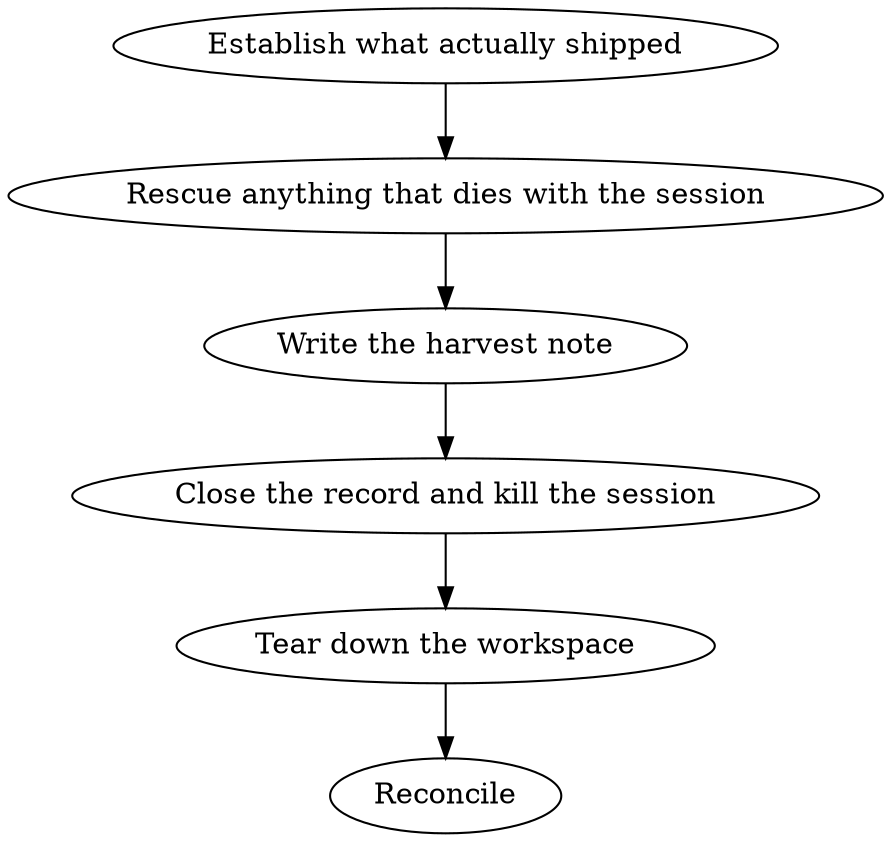

# harvest

Close out a dispatch. Skill input: a finished (or abandoned) dispatched session. Skill output: a task
file that records what the session actually produced, and a workspace that leaves nothing running.

`/dispatch` is the opening half of this lifecycle. This is the closing half.

**Use when:** a session reports done, a PR merges, a session is being abandoned mid-flight, or a
reconcile shows `tmux ls` and `status: running` task files disagreeing.

**Do NOT use** for `spawn:wt-agent` worktrees or own-folder mode dispatches under `~/dev/<TICKET>/`
— those are cleaned up by hand and are not tracked by a spawn file.

## What this skill is for

Baseline testing showed an agent asked to "harvest a dispatch" already does the git-safety part well
without instruction: it checks for uncommitted and unpushed work and refuses to delete a branch whose
only copy is local. **Do not add ceremony around that — trust it, and keep the judgment.**

What an agent cannot infer is the hub-specific half: the task file is the durable record, tmux holds
the session, the session may have left a stack running, and its evidence may live in a scratchpad
that does not survive a reboot. Those are the steps this skill exists to supply.

## Workflow



## Step 1 — Establish what actually shipped

Do not take the session's word for it. Check the repo.

```bash
cd <workspace>
git fetch -q --prune origin
gh pr list --state all --head <branch> --json number,state,mergeCommit,additions,deletions,files,commits
git status --porcelain                       # uncommitted?
git log --oneline --branches --not --remotes # local-only commits?
git diff origin/<base> HEAD --stat           # empty = content landed
git ls-remote --heads origin <branch>        # empty = remote branch deleted
```

**A squash merge gives the branch a different SHA from `main`**, so "N commits ahead" is normal and
proves nothing. Content identity is what proves the work landed.

**Sessions drift onto branches their task file never mentions.** If the branch does not match the
task file's `branch:`, find every PR the session opened before deciding anything is done.

**Block on:** uncommitted changes, or commits on no remote and no merge. Surface them and ask. Never
resolve this by deleting.

## Step 2 — Rescue anything that dies with the session

Two things are lost the moment the session is killed, and both have been lost before.

- **Scratchpad artifacts.** Screenshots, galleries, findings files under
  `/private/tmp/claude-*/<project>/<uuid>/scratchpad/`. If the harvest note is going to cite them,
  copy them to `~/dev/hub/plans/artifacts/<date>-<slug>/` first and cite that path instead.
- **Undispatched findings.** A long-running session accumulates observations that never became
  their own work. Ask it for them **before** teardown — it cannot answer afterwards. Treat *"what
  did you find that nobody picked up?"* as a required question, not an optional one.

## Step 3 — Write the harvest note

The note is the deliverable. It is read months later by someone deciding whether to trust the work.

**Required slots**, in the task file's `## Harvest (<date>)` section:

| Slot | Content |
|---|---|
| Outcome | PR number, merge commit, diff size, and whether it deployed |
| Scope delta | What shipped that the brief did not ask for, or asked for and did not get |
| Verification | What was actually run, and what was skipped — name the gaps |
| Residuals | Known-accepted gaps, in the session's own words where it stated them |
| Loose ends | Databases, fixtures, remote branches, processes left behind |
| Successor | The spawn file or memo this hands off to, if any |

A note that only says "merged, all green" has thrown away the reason for writing it.

## Step 4 — Close the record and kill the session

Do these together. A task file flipped to `harvested` while its tmux session still runs is the
single most common way the fleet's state goes wrong.

```bash
# frontmatter: record pr: and harvested_at:, flip status:
# then, in the same step:
tmux kill-session -t "<Session Name>"
```

**`pr:` is blank on every task file** — the launch step does not populate it and nothing else does.
Harvest is the only point it gets recorded. Leaving it blank means the next person reconciling the
fleet from task files inherits a PR-shaped blind spot.

Watch for trailing whitespace in the frontmatter (`pr: ` with a space) — a naive string replace
silently no-ops. Read the field back after writing it.

## Step 5 — Tear down the workspace

```bash
git -C <canonical-clone> worktree remove <workspace>
git -C <canonical-clone> worktree prune
git -C <canonical-clone> branch -D <branch>        # only after Step 1 cleared it
rmdir ~/dev/dispatched/<slug>
git -C <canonical-clone> fetch -q origin && git -C <canonical-clone> merge --ff-only origin/<base>
```

Remove a worktree **through its parent repo**, never with `rm -rf` — that leaves the registry
pointing at a path that no longer exists.

**Stop the session's stack, and attribute processes by working directory rather than by port.** A
session mentions the ports it knows about; it does not know about the ones it forgot. Killing only
the mentioned ports leaves orphans holding a deleted cwd:

```bash
for pid in $(lsof -nP -iTCP -sTCP:LISTEN | awk 'NR>1 {print $2}' | sort -u); do
  cwd=$(lsof -a -p "$pid" -d cwd -Fn 2>/dev/null | sed -n 's/^n//p')
  case "$cwd" in *<slug>*) echo "$pid  $cwd";; esac
done
```

Confirm they are gone before removing the worktree — a live process holding files can fail the
removal quietly.

## Step 6 — Reconcile

```bash
tmux ls
grep -l '^status: running' ~/dev/hub/tasks/spawn-*.md
git -C <canonical-clone> worktree list
ls ~/dev/dispatched/
```

All four must agree. A tmux session with no running task file, or a task file with no session, means
a previous harvest ended halfway.

## Quick reference

| Symptom | Cause |
|---|---|
| Branch "N ahead" of main after a merge | Squash merge — compare content, not SHAs |
| `git worktree remove` fails | A live process from that session is holding files |
| Task file says a branch the PR does not | Session drifted; find all its PRs |
| `pr:` edit silently did nothing | Trailing space in the frontmatter value |
| `tmux ls` disagrees with `status: running` | A previous harvest stopped halfway |

## Common mistakes

- **Killing the tmux session before asking for its findings.** Unrecoverable. Ask first.
- **Citing `/tmp` paths in the harvest note.** They do not survive a reboot. Copy, then cite.
- **Trusting "my work is done."** Check the repo; the two disagree more often than expected.
- **A one-line harvest note.** The note is the artifact; the cleanup is the easy part.
